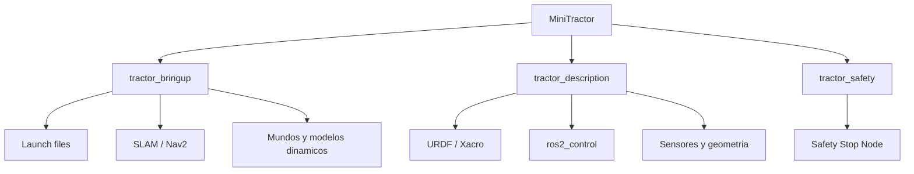
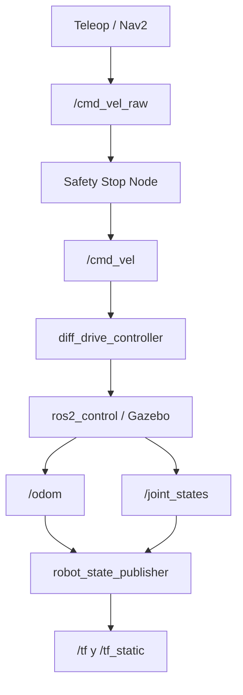
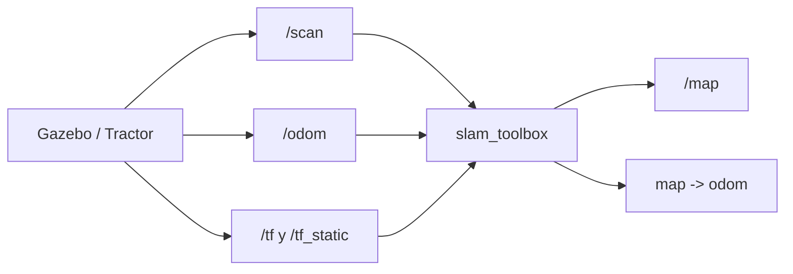
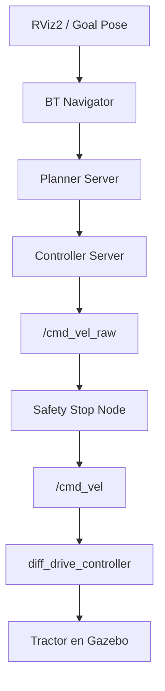
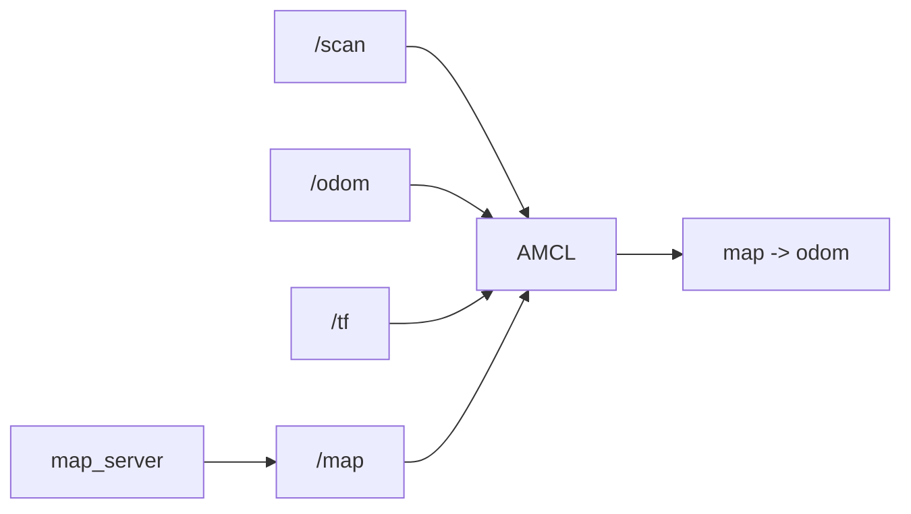
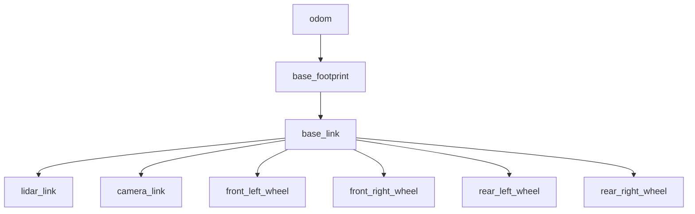

# Arquitectura

## Objetivo

Este documento describe la arquitectura general de **MiniTractor**, los componentes que lo integran y el flujo de información entre ellos.

El proyecto sigue una arquitectura modular basada en paquetes de ROS 2, donde cada componente tiene una responsabilidad claramente definida.

Esta organización facilita el mantenimiento del código y permite incorporar nuevas funcionalidades sin afectar la estructura existente.

---

# Arquitectura general

Actualmente MiniTractor está compuesto por tres paquetes principales:



Cada uno posee una única responsabilidad dentro del sistema.

---

# Componentes

## tractor_description

Es el paquete encargado de describir completamente el robot.

Contiene todos los recursos relacionados con su representación física.

Entre ellos:

- URDF
- Xacro
- configuración de ros2_control
- Meshes
- Configuración de RViz
- Mundos de Gazebo

Su responsabilidad termina una vez que el modelo del robot ha sido generado.

No contiene lógica de navegación ni de control.

---

## tractor_bringup

Es el paquete encargado de iniciar el sistema completo.

Desde aquí se ejecutan todos los launch files necesarios para la simulación.

Entre sus responsabilidades se encuentran:

- iniciar Gazebo
- cargar el mundo virtual
- publicar el robot
- insertar el tractor en la simulación
- iniciar Safety Stop
- iniciar SLAM Toolbox cuando se solicita mapeo
- iniciar Navigation2 y RViz2 cuando se solicita navegación
- instalar configuraciones, modelos dinámicos y mundos de simulación

Puede considerarse como el punto de entrada principal del proyecto.

---

## tractor_safety

Implementa el nodo **Safety Stop**.

Su objetivo es supervisar continuamente el LiDAR para evitar colisiones.

Cuando detecta un obstáculo dentro de la distancia configurada:

- bloquea el movimiento hacia adelante;
- permite continuar girando o retrocediendo;
- protege al robot frente a obstáculos inesperados.

La configuración actual del launch base usa:

```text
stop_distance: 0.8 m
forward_angle_deg: 45.0
```

`forward_angle_deg` se aplica hacia ambos lados del frente del LiDAR, por lo que Safety Stop revisa aproximadamente 90 grados frontales en total.

---

# Arquitectura ROS 2

Actualmente el flujo de información puede representarse de la siguiente manera:



Toda la comunicación entre componentes se realiza mediante los mecanismos estándar de ROS 2:

- Topics
- TF
- Launch Files
- Parámetros

El tópico `/cmd_vel_raw` es la entrada de comandos del usuario o de herramientas de teleoperación.
El tópico `/cmd_vel` queda reservado como salida filtrada del nodo Safety Stop hacia `diff_drive_controller`.

---

# SLAM

La integración de SLAM Toolbox utiliza los datos ya publicados por la simulación:

- `/scan`;
- `/odom`;
- `/tf`;
- `/tf_static`.

El flujo de mapeo es:



`slam_toolbox` publica la transformación `map -> odom`, mientras que `diff_drive_controller` mantiene la odometría y el resto de la cadena TF del tractor.

El launch dedicado para esta integración es:

```bash
ros2 launch tractor_bringup sim_with_slam.launch.py
```

El script equivalente del proyecto es:

```bash
./scripts/slam_run.sh
```

Para generar mapas persistentes del huerto, el mundo base no incluye obstáculos temporales en medio del pasillo. Los obstáculos de prueba se agregan dinámicamente durante la simulación.

---

# Navigation2

Navigation2 utiliza el mapa guardado por SLAM Toolbox para localizar y navegar el tractor de forma autónoma.

El flujo de navegación es:



El flujo de localización es:



Nav2 no publica directamente hacia `/cmd_vel`. Su salida se remapea a `/cmd_vel_raw` para conservar `tractor_safety` como filtro final antes del controlador.

La configuración principal está en:

```text
tractor_bringup/config/nav2_params.yaml
```

Incluye:

- `global_costmap` con mapa estático del huerto;
- `local_costmap` de 2 metros alrededor del tractor;
- `inflation_layer` para mantener margen frente a troncos;
- AMCL para publicar `map -> odom`;
- velocidades conservadoras para pasillos estrechos.

El comportamiento ante bloqueos se documenta en:

```text
docs/06_Recovery_behaviors.md
```

El launch dedicado es:

```bash
ros2 launch tractor_bringup sim_with_nav2.launch.py
```

Scripts equivalentes:

```bash
./scripts/nav_run.sh
./scripts/nav_rviz.sh
```

---

# Obstáculos dinámicos

La caja roja de prueba no forma parte fija del mundo `huerto_papayos.world`.

Se gestiona como un modelo dinámico de Gazebo desde:

```text
tractor_bringup/models/caja_obstaculo/model.sdf
```

Esto permite usar el mismo entorno para dos casos:

- mapeo limpio con SLAM;
- pruebas de Safety Stop con un obstáculo temporal.

Agregar la caja:

```bash
./scripts/obstacle_add.sh
```

Quitar la caja:

```bash
./scripts/obstacle_remove.sh
```

Por defecto se inserta en el centro del pasillo:

```text
x=7.0, y=0.0, z=0.35
```

También puede moverse usando variables de entorno:

```bash
OBSTACLE_X=5.0 OBSTACLE_Y=0.5 ./scripts/obstacle_add.sh
```

---

# Sensores

Actualmente el tractor incorpora los siguientes sensores virtuales.

## LiDAR

Utilizado para:

- detección de obstáculos;
- Safety Stop;
- SLAM;
- Navigation2.

---

## Cámara

Permite visualizar el entorno desde el tractor.

Actualmente se utiliza con fines de simulación y depuración.

Su integración servirá como base para futuros desarrollos relacionados con visión artificial.

---

## Odometría

Generada por Gazebo.

Se utiliza para:

- estimación de la posición del robot;
- publicación del frame `odom`;
- integración con SLAM Toolbox;
- integración con AMCL y Navigation2.

---

# Frames TF

Actualmente el sistema publica la siguiente jerarquía de transformaciones.



Esta estructura sirve como base para SLAM, AMCL y Navigation2.

---

# Flujo de ejecución

Cuando el usuario ejecuta:

```bash
./scripts/sim_run.sh
```

ocurre la siguiente secuencia:

1. Se carga el entorno de ROS 2.
2. Se inicia Gazebo.
3. Se carga el mundo del huerto.
4. Se publica el modelo del tractor.
5. El robot es insertado en la simulación.
6. Se activan `joint_state_broadcaster` y `diff_drive_controller`.
7. Se inicia el nodo Safety Stop.
8. Comienza la publicación de sensores, odometría y transformaciones.

Una vez completado este proceso, el tractor queda listo para recibir comandos mediante teleoperación.

---

# Estado actual

En la versión actual del proyecto el tractor es capaz de:

- iniciar correctamente en Gazebo;
- publicar TF;
- generar odometría;
- publicar datos del LiDAR;
- publicar imágenes de la cámara;
- detenerse automáticamente ante obstáculos;
- desplazarse mediante comandos de teclado;
- utilizar controladores estándar de `ros2_control`;
- generar mapas con SLAM Toolbox;
- guardar mapas en `workspace/maps/`;
- agregar y quitar obstáculos dinámicos;
- localizarse con AMCL sobre un mapa estático;
- ejecutar Navigation2 con costmaps y Goal Pose desde RViz2.

---

# Evolución implementada

La arquitectura del proyecto ha evolucionado de forma incremental.

## v0.3.0

La arquitectura basada en **ros2_control** incorpora:

- controller_manager
- diff_drive_controller
- joint_state_broadcaster

Esto proporciona interfaces estándar de control para ROS 2 y prepara el proyecto para SLAM, Nav2 y futuras variantes de hardware.

---

## v0.4.0

Integra **SLAM Toolbox**.

El flujo de información incorpora:

- LiDAR
- Odometría
- SLAM Toolbox
- Generación de mapas

permitiendo construir mapas persistentes del huerto.

---

## v0.5.0

Integra **Navigation2**.

La arquitectura añade:

- AMCL
- Planner Server
- Controller Server
- BT Navigator
- Global Costmap
- Local Costmap
- Recovery Behaviors

Con ello el tractor puede localizarse, planificar trayectorias y ejecutar navegación autónoma básica dentro del huerto mediante `Goal Pose`.

El ajuste fino de navegación seguirá evolucionando con pruebas de campo simulado, costmaps, inflation layer y recovery behaviors.

---

# Filosofía de diseño

Durante toda la evolución del proyecto se mantendrán los siguientes principios:

- una responsabilidad por paquete;
- una única fuente de configuración;
- separación entre descripción, control y navegación;
- reutilización de componentes estándar de ROS 2;
- compatibilidad con Docker;
- documentación sincronizada con el código.

Esta filosofía permitirá que MiniTractor continúe creciendo sin comprometer su mantenibilidad ni la claridad de su arquitectura.
