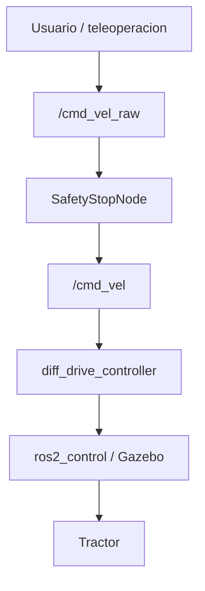

# Comandos frecuentes

Este documento reúne los comandos más utilizados durante el desarrollo de **MiniTractor**.

Los comandos de ROS 2 deben ejecutarse dentro del contenedor Docker del proyecto, salvo que se indique lo contrario.

---

# Estructura del proyecto

```bash
cd ~/MiniTractor
tree -L 3
```

Estructura esperada:

```text
MiniTractor/
├── docker/
├── docs/
├── scripts/
├── workspace/
│   ├── maps/
│   └── src/
│       ├── tractor_bringup/
│       ├── tractor_description/
│       └── tractor_safety/
├── AGENTS.md
├── README.md
└── .gitignore
```

---

# Docker

Construir la imagen:

```bash
./scripts/docker_build.sh
```

Entrar al contenedor:

```bash
./scripts/docker_shell.sh
```

Detener contenedores del proyecto:

```bash
./scripts/docker_stop.sh
```

Este comando es el punto explícito para detener contenedores Docker de MiniTractor.

---

# Workspace

Compilar:

```bash
./scripts/ws_build.sh
```

Limpiar `build/`, `install/` y `log/` tras confirmación:

```bash
./scripts/ws_clean.sh
```

Diagnosticar el entorno:

```bash
./scripts/ws_doctor.sh
```

Compilación manual:

```bash
cd ~/MiniTractor/workspace
source /opt/ros/humble/setup.bash
colcon build --symlink-install
source install/setup.bash
```

Compilar un paquete específico:

```bash
colcon build --packages-select tractor_description --symlink-install
colcon build --packages-select tractor_bringup --symlink-install
colcon build --packages-select tractor_safety --symlink-install
```

---

# Simulación

Iniciar la simulación completa:

```bash
./scripts/sim_run.sh
```

Detener procesos locales de simulación:

```bash
./scripts/sim_stop.sh
```

Este comando no detiene contenedores Docker. Para eso usa `./scripts/docker_stop.sh`.

Lanzamiento manual:

```bash
cd ~/MiniTractor/workspace
source /opt/ros/humble/setup.bash
source install/setup.bash
ros2 launch tractor_bringup sim_with_safety.launch.py
```

Visualizar únicamente el modelo del tractor en Gazebo:

```bash
ros2 launch tractor_description display.launch.py
```

---

# SLAM

Iniciar la simulación con SLAM Toolbox:

```bash
./scripts/slam_run.sh
```

Lanzamiento manual equivalente:

```bash
cd ~/MiniTractor/workspace
source /opt/ros/humble/setup.bash
source install/setup.bash
ros2 launch tractor_bringup sim_with_slam.launch.py
```

Durante el mapeo, teleopera el tractor por todo el entorno virtual en Gazebo:

```bash
./scripts/sim_teleop.sh
```

Guardar el mapa con el nombre recomendado:

```bash
./scripts/slam_save_map.sh
```

Guardar el mapa con un nombre personalizado:

```bash
./scripts/slam_save_map.sh huerto_map
```

Comando manual equivalente:

```bash
ros2 run nav2_map_server map_saver_cli -f ~/MiniTractor/workspace/maps/huerto_map
```

El guardado genera:

- `workspace/maps/huerto_map.pgm`;
- `workspace/maps/huerto_map.yaml`.

Los mapas generados se ignoran en Git para evitar versionar salidas temporales.

---

# Obstáculos dinámicos

Agregar la caja roja de prueba en el pasillo:

```bash
./scripts/obstacle_add.sh
```

Quitar la caja roja:

```bash
./scripts/obstacle_remove.sh
```

Agregarla en otra posición:

```bash
OBSTACLE_X=5.0 OBSTACLE_Y=0.5 ./scripts/obstacle_add.sh
```

Nombre y posición por defecto:

```text
OBSTACLE_NAME=caja_obstaculo
OBSTACLE_X=7.0
OBSTACLE_Y=0.0
OBSTACLE_Z=0.35
OBSTACLE_YAW=0.0
```

Para mapeo con SLAM se recomienda generar el mapa sin este obstáculo, y agregarlo después para probar Safety Stop o futuros comportamientos de navegación.

---

# Navigation2

Antes de iniciar Nav2 debe existir un mapa guardado:

```text
workspace/maps/huerto_map.yaml
workspace/maps/huerto_map.pgm
```

Iniciar la simulación con Navigation2:

```bash
./scripts/nav_run.sh
```

Usar otro mapa:

```bash
./scripts/nav_run.sh ~/MiniTractor/workspace/maps/otro_mapa.yaml
```

Comando manual equivalente:

```bash
ros2 launch tractor_bringup sim_with_nav2.launch.py \
  map:=~/MiniTractor/workspace/maps/huerto_map.yaml
```

Comando base de Nav2 encapsulado por el proyecto:

```bash
ros2 launch nav2_bringup bringup_launch.py map:=/path/to/huerto_map.yaml
```

Abrir RViz2 para enviar objetivos:

```bash
./scripts/nav_rviz.sh
```

Flujo recomendado:

```text
Terminal 1: ./scripts/nav_run.sh
Terminal 2: ./scripts/nav_rviz.sh
```

En RViz2:

- usa `2D Pose Estimate` si AMCL necesita pose inicial;
- usa `Goal Pose` para enviar un objetivo;
- revisa `Global Costmap`, `Local Costmap` y `Global Plan`.

Nav2 publica comandos hacia `/cmd_vel_raw`, para que Safety Stop siga filtrando antes de `/cmd_vel`.

Reporte técnico de recuperación:

```text
docs/06_Recovery_behaviors.md
```

---

# Teleoperación

En una segunda terminal, entrar al contenedor y ejecutar:

```bash
./scripts/sim_teleop.sh
```

Comando manual equivalente:

```bash
ros2 run teleop_twist_keyboard teleop_twist_keyboard \
  --ros-args \
  --remap cmd_vel:=/cmd_vel_raw \
  -p speed:=0.5 \
  -p turn:=1.8
```

Para ajustar la sensibilidad desde el script:

```bash
TELEOP_TURN=2.0 ./scripts/sim_teleop.sh
```

Teclas principales:

| Tecla | Acción |
|-------|--------|
| `i` | Avanzar |
| `,` | Retroceder |
| `j` | Girar izquierda |
| `l` | Girar derecha |
| `k` | Detener |
| `u` | Avanzar girando izquierda |
| `o` | Avanzar girando derecha |
| `m` | Retroceder girando |
| `.` | Retroceder girando |

---

# Arquitectura de control actual

Actualmente el flujo de comandos es:



No se recomienda publicar directamente sobre `/cmd_vel`, porque evita el filtro de seguridad.

---

# Movimiento manual

Avanzar:

```bash
ros2 topic pub --rate 10 /cmd_vel_raw geometry_msgs/msg/Twist \
"{linear: {x: 0.5}, angular: {z: 0.0}}"
```

Retroceder:

```bash
ros2 topic pub --rate 10 /cmd_vel_raw geometry_msgs/msg/Twist \
"{linear: {x: -0.5}, angular: {z: 0.0}}"
```

Girar izquierda:

```bash
ros2 topic pub --rate 10 /cmd_vel_raw geometry_msgs/msg/Twist \
"{linear: {x: 0.0}, angular: {z: 0.8}}"
```

Girar derecha:

```bash
ros2 topic pub --rate 10 /cmd_vel_raw geometry_msgs/msg/Twist \
"{linear: {x: 0.0}, angular: {z: -0.8}}"
```

Detener:

```bash
ros2 topic pub --once /cmd_vel_raw geometry_msgs/msg/Twist \
"{linear: {x: 0.0}, angular: {z: 0.0}}"
```

---

# Inspección ROS 2

Listar nodos:

```bash
ros2 node list
```

Inspeccionar el nodo Safety Stop:

```bash
ros2 node info /safety_stop_node
```

Listar tópicos:

```bash
ros2 topic list
```

Inspeccionar tópicos principales:

```bash
ros2 topic info /cmd_vel_raw
ros2 topic info /cmd_vel
ros2 topic info /scan
ros2 topic info /odom
ros2 topic info /map
ros2 topic info /amcl_pose
```

Escuchar mensajes:

```bash
ros2 topic echo /scan --once
ros2 topic echo /odom --once
ros2 topic echo /cmd_vel_raw
ros2 topic echo /cmd_vel
ros2 topic echo /amcl_pose --once
```

Medir frecuencias:

```bash
ros2 topic hz /scan
ros2 topic hz /odom
ros2 topic hz /joint_states
```

Costmaps de Nav2:

```bash
ros2 topic info /global_costmap/costmap
ros2 topic info /local_costmap/costmap
```

---

# Sensores

LiDAR:

```bash
ros2 topic echo /scan --once
ros2 topic hz /scan
```

Cámara:

```bash
ros2 topic info /front_camera/image_raw
ros2 topic info /front_camera/camera_info
```

Odometría:

```bash
ros2 topic echo /odom --once
ros2 topic hz /odom
```

---

# TF

Verificar mensajes TF:

```bash
ros2 topic echo /tf --once
```

Generar el árbol de frames:

```bash
ros2 run tf2_tools view_frames
```

Si la herramienta no está disponible, debe añadirse a la imagen Docker en una etapa controlada.

---

# Parámetros

Listar parámetros:

```bash
ros2 param list
```

Consultar parámetros del Safety Stop:

```bash
ros2 param list /safety_stop_node
ros2 param get /safety_stop_node stop_distance
ros2 param get /safety_stop_node forward_angle_deg
```

Valores actuales del launch base:

```text
stop_distance = 0.8 m
forward_angle_deg = 45.0
```

El ángulo se evalúa hacia ambos lados del frente del LiDAR, por lo que cubre aproximadamente 90 grados frontales.

---

# Paquetes

Listar paquetes del proyecto:

```bash
ros2 pkg list | grep tractor
```

Buscar paquetes de Gazebo:

```bash
ros2 pkg list | grep gazebo
```

---

# Xacro

Validar el Xacro:

```bash
xacro ~/MiniTractor/workspace/src/tractor_description/urdf/tractor.urdf.xacro
```

Guardar el URDF generado:

```bash
xacro ~/MiniTractor/workspace/src/tractor_description/urdf/tractor.urdf.xacro > /tmp/mini_tractor.urdf
```

---

# Búsqueda

Buscar archivos:

```bash
find ~/MiniTractor -name "tractor.urdf.xacro"
```

Buscar texto:

```bash
grep -R "gazebo_ros2_control" ~/MiniTractor/workspace/src
grep -R "cmd_vel_raw" ~/MiniTractor/workspace/src
```

---

# Git

Estado del repositorio:

```bash
git status
```

Ver historial:

```bash
git log --oneline
```

Ver etiquetas:

```bash
git tag
```

---

# ros2_control

Listar controladores:

```bash
ros2 control list_controllers
```

Listar interfaces de hardware:

```bash
ros2 control list_hardware_interfaces
```

Listar componentes de hardware:

```bash
ros2 control list_hardware_components
```
