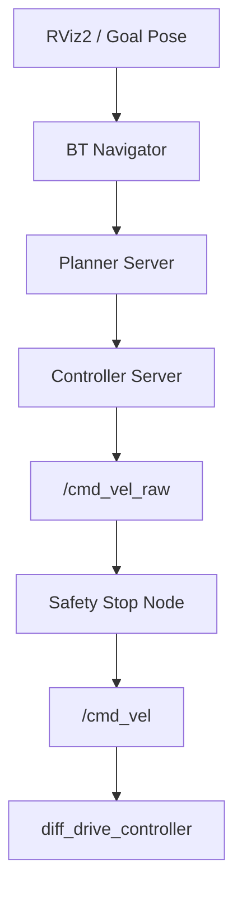
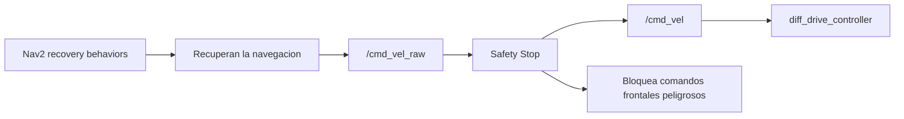
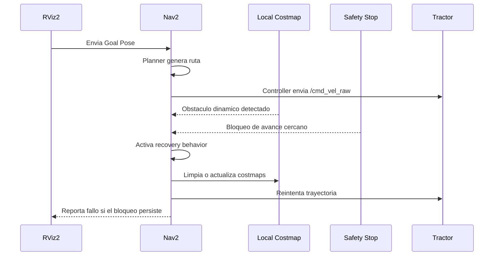

# Recovery Behaviors en Navigation2

## Objetivo

Este reporte describe, de forma breve, cómo actúa **Navigation2** cuando MiniTractor se bloquea, pierde la ruta o no puede avanzar hacia el objetivo.

El propósito de los recovery behaviors es evitar que un fallo local de navegación termine inmediatamente en un error global. En lugar de detener toda la misión, Nav2 intenta recuperar una condición válida para volver a planificar o continuar.

---

# Contexto en MiniTractor

MiniTractor usa Nav2 sobre un mapa estático generado previamente con SLAM Toolbox.

El flujo principal es:



La decisión arquitectónica importante es que Nav2 no manda comandos directamente a `/cmd_vel`. Sus comandos pasan primero por `/cmd_vel_raw`, para que `tractor_safety` conserve la última palabra antes del controlador.

---

# Cuándo se activan

Los recovery behaviors pueden activarse cuando:

- el planner no encuentra una ruta válida;
- el controller no logra seguir la trayectoria;
- aparece un obstáculo en el local costmap;
- el robot no progresa durante cierto tiempo;
- la trayectoria planeada deja de ser válida;
- AMCL no tiene una localización suficientemente útil;
- Safety Stop bloquea el avance porque detecta un obstáculo cercano.

En MiniTractor, estos casos pueden ocurrir fácilmente en pasillos estrechos del huerto o cuando se agrega la caja roja dinámica.

---

# Behaviors configurados

La configuración actual está en:

```text
workspace/src/tractor_bringup/config/nav2_params.yaml
```

El `behavior_server` incluye:

```yaml
behavior_plugins:
  - spin
  - backup
  - drive_on_heading
  - wait
```

## Spin

Hace que el robot gire sobre su propio eje.

Sirve para:

- buscar una orientación mejor;
- despejar dudas del local costmap;
- intentar recuperar visibilidad del entorno;
- permitir que el planner encuentre una ruta alternativa.

Riesgo:

En pasillos estrechos, un giro amplio puede acercar las esquinas del tractor a los troncos. Por eso las velocidades angulares de Nav2 están configuradas de forma conservadora.

## BackUp

Hace que el robot retroceda una distancia corta.

Sirve para:

- salir de una zona demasiado cercana a un obstáculo;
- liberar espacio para volver a girar o planificar;
- recuperarse cuando Safety Stop bloquea el avance.

Riesgo:

Safety Stop solo bloquea avance hacia adelante. Retroceder puede ser útil, pero en una versión futura convendría evaluar protección trasera si se agregan sensores posteriores.

## DriveOnHeading

Intenta mover el robot en una dirección definida durante una recuperación.

Sirve para:

- salir de una zona local conflictiva;
- ejecutar movimientos simples cuando el controlador normal no logra progresar.

Riesgo:

Debe mantenerse con velocidades moderadas para evitar movimientos bruscos dentro del huerto.

## Wait

Hace que el robot espere.

Sirve para:

- dar tiempo a que el costmap se actualice;
- esperar a que desaparezca un obstáculo dinámico;
- evitar reacciones demasiado agresivas ante una lectura temporal del LiDAR.

Riesgo:

Si el obstáculo es permanente, esperar no resolverá el bloqueo. En ese caso Nav2 deberá replantear o reportar fallo.

---

# Relación con Safety Stop

Safety Stop y los recovery behaviors cumplen funciones distintas.



Si Nav2 intenta avanzar y Safety Stop detecta un obstáculo en la zona frontal, el comando lineal se bloquea. Nav2 puede interpretar la falta de progreso como un bloqueo y activar recuperación.

Esto es deseable porque mantiene dos capas:

- una capa de navegación que razona sobre rutas y costmaps;
- una capa reactiva de seguridad que protege frente a obstáculos cercanos.

---

# Flujo típico de bloqueo

Un caso esperado con la caja roja dinámica sería:



---

# Límites actuales

La configuración actual es una base funcional, no un ajuste final de campo.

Puntos a observar durante pruebas:

- si el robot gira demasiado cerca de los troncos;
- si retrocede demasiado poco o demasiado;
- si el local costmap detecta la caja roja a tiempo;
- si la inflation layer deja suficiente margen;
- si Safety Stop bloquea con demasiada frecuencia;
- si AMCL necesita pose inicial manual desde RViz2.

---

# Recomendaciones de prueba

1. Generar un mapa limpio sin la caja roja.
2. Lanzar Nav2 con:

```bash
./scripts/nav_run.sh
```

3. Abrir RViz2:

```bash
./scripts/nav_rviz.sh
```

4. Enviar un `Goal Pose` sencillo dentro del mismo pasillo.
5. Agregar la caja roja:

```bash
./scripts/obstacle_add.sh
```

6. Observar:

- local costmap;
- global costmap;
- plan global;
- movimiento del tractor;
- mensajes de Nav2;
- activación de Safety Stop.

---

# Conclusión

Los recovery behaviors permiten que MiniTractor no dependa de una única trayectoria perfecta. Cuando el robot encuentra un bloqueo, Nav2 puede esperar, girar, retroceder o intentar recuperar una condición navegable.

En este proyecto, su valor principal es educativo y arquitectónico: muestran cómo combinar navegación deliberativa con una capa reactiva de seguridad. Nav2 intenta resolver el problema de navegación, mientras Safety Stop evita que una orden peligrosa llegue al controlador.
